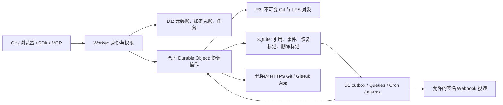

# 架构设计 — v0.3 基线

**简体中文** · [English](en/ARCHITECTURE.md)

vexuni 是一个运行在 Cloudflare 上的小型代码托管平台：Git 协议、网页与 API 全部用 JavaScript 实现，对象保存在 R2，引用由 Durable Object 原子发布，元数据落在 D1。本文描述存储与发布顺序、并发模型和安全边界。

Git 存储与 HTTP 路径后续加入了 [v0.12 索引和流式处理](GIT-SCALE-v12.md)；云端执行与协作能力见 [v0.5 及后续文档](CLOUD-NATIVE-v05.md)。当前平台由主服务、私有 WASM 编译服务、独立应用网关三个 Worker 组成。

本项目参考 Code Storage 的公开文档独立实现。Git 处理全部使用 Cloudflare Workers 中的 JavaScript，不依赖容器、原生 Git 进程、SSH 守护进程，也不在 Git 接收路径执行仓库代码。原生 Git 仅作为测试客户端和兼容性对照。Web Crypto 负责哈希和签名检查，pako 处理 zlib，RE2JS 限制正则计算，jsdiff/node-diff3 处理文本差异与合并，OpenPGP 处理文本封装的签名。

## 对象存储与引用发布

R2 的 `repos/<UUID>/objects/<SHA1>` 保存未压缩的标准 `type size\0payload` 字节。读取时验证 SHA-1 和长度；条件创建遇到已有对象时核对原字节，不覆盖。仓库之间不做对象去重。Tree 保留二进制 Blob、UTF-8 路径、可执行位、符号链接和外部 gitlink。入站 pack 支持 v2/v3、OFS_DELTA、REF_DELTA、前向基对象和 thin pack，并检查校验和、展开量与对象图预算。出站 pack 使用独立 zlib 压缩的完整对象。

外层 Worker 求得可信的仓库 UUID、角色、操作者、当前签名密钥和委托限制。按 UUID 定位的 DO 用 Promise 队列协调操作，最多 16 个排队或执行中的请求。写操作检查预期引用、图连通性和策略，先写 R2，再通过单次 DO storage put 原子保存完整 `refs.v2` 字典和 push 事件。发布前失败不会改变引用，但可能遗留不可达对象。发布后、响应前失败的结果对客户端不确定，重试前应读取引用。

普通 heads/tags/notes 与 `refs/namespaces/ephemeral/` 共用原子引用存储。命名空间视图阻止内部路径注入，发布时保留其他命名空间。权威默认分支保存在 DO，D1 仅为元数据投影。Git v0/v2 只读取授权且可达的对象；私有仓库要求成员身份或有效凭据。不支持 shallow、filter、SHA-256 仓库或 SSH 传输。

## Git API 与签名

Forge API 生成真实 Tree/Commit、Notes 引用、Diff/Patch 和恢复提交。NDJSON 逐步消费输入，并限制结束标记和解码量；对象仍在有界请求内存中暂存，引用只发布一次。Tar 和原始下载采用流式响应。搜索限制 RE2 计算、遍历和输出。Blame 遍历父提交，对重命名、移动和复制采用保守归属。合并预览不可变且不发布引用；三方合并和 squash 校验固定目标提交，遇到冲突返回结果，不发布冲突文本。明确不支持多个递归合并基点。

PAT 写入默认禁止强推。委托 JWT 独立限定仓库范围，并按顺序应用首条匹配的引用限制。`verify-sig` 对每个新引入的提交，用当前登记公钥验证 SSHSSIG/OpenPGP 签名，并向客户端暴露签名文本和载荷元数据。API 生成的无签名提交不能绕过同一发布检查。

## 生命周期与异步持久性

Fork 预留新 UUID，复制期间持有目标 DO 队列，避免删除/GC 与迟到的对象写入竞争。它将源仓库可达快照复制到独立 R2 路径，验证并发布引用，再清除初始化状态；不会建立后续同步关系。删除先给 DO 写 tombstone，再隐藏或改名 D1 元数据；alarm 分批清理 Git/LFS，最后级联删除元数据。遇到删除标记时操作安全拒绝。活跃仓库不可达对象 GC、跨存储快照备份尚未实现。

引用事件与引用一起原子写入 DO，再由 alarm 幂等投影为 D1 投递记录。其他协作事件来自 D1 审计/outbox 批次。Queues 向允许的 HTTPS 接收端投递，使用尝试租约、时间戳加正文签名，最多尝试五次，由接收端去重。Cron 重放待处理工作。Queue 或 D1 投影失败不会丢失已提交引用事件；Git 与协作元数据仍不是一个分布式事务。

## 上游与恢复

通用 HTTPS Git 和 GitHub App 模式使用纯 JavaScript 协议客户端。Pull 下载并验证受预算限制的完整可达对象图，持久化后发布 heads/tags，保留本地 Notes 和临时引用。公开 GitHub 模式只支持手动单向刷新。所有出站 URL 必须属于内置提供方或操作者允许的主机，不跟随重定向。

双向写入先验证策略并刷入 R2，再保存持久 `sync-reconcile` 标记并安排 alarm。向上游推送使用其通告的旧 SHA；多引用操作要求上游支持 atomic，仅上游接受后才本地发布。任何不确定结果都保留恢复标记，在队列/DO alarm 实际拉取并核对上游引用前阻止普通操作。自动恢复有上限，也可手动重试 Pull。这不是跨提供方原子事务，但不会虚构推送成功。临时命名空间操作不离开 vexuni。

凭据和 GitHub App 私钥使用 AES-256-GCM、随机 IV、仓库/账户特定关联数据加密后存入 D1；加密密钥是 Worker secret。GitHub 安装 JWT 只申请指定仓库的令牌。入站签名 Webhook 先去重再入队。GitHub App LFS 校验 batch/action 主机与 SHA-256/长度后缓存，不向任意 action 主机发送安装凭据。通用/公开上游的 LFS 明确拒绝。

## 升级与运行边界

基线 D1 migrations 0001–0004 为增量迁移；保留 Worker/DO 类名、UUID 映射和迁移历史。v0.1 tar 快照导入器用于旧本地实例：先导入并验证对象，再原子发布引用，保留旧 snapshot。后续写入不会同步到旧格式，不应盲目回滚。

遵守[资源预算](LIMITS.md)，平台 CPU、内存和子请求限制可能先触发。不承诺总配额、TB 级基准、生产 SLA、SHA1DC 检测、全站自动恢复或独立安全审计。备份需包含 D1、R2、DO 状态（含待投递事件和恢复标记），并妥善保存加密密钥。Git 存储服务不得执行仓库代码；后续 CI 的执行发生在单独授权的隔离运行环境中。
