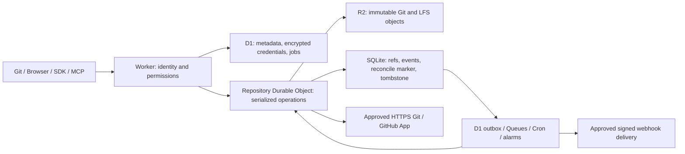

# Architecture

[简体中文](../ARCHITECTURE.md) · **English**

vexuni is a small code hosting platform running on Cloudflare: the Git protocol, the website, and every API are implemented in JavaScript, objects live in R2, refs are published atomically by a Durable Object, and metadata lives in D1. This document describes the storage and publication ordering, the concurrency model, and the security boundaries.

The Git storage/HTTP path is extended by [v0.12 indexing and streaming](GIT-SCALE-v12.md); cloud execution and collaboration are documented in [v0.5+](CLOUD-NATIVE-v05.md).

Independent JavaScript implementation. All Git processing is JavaScript in Cloudflare Workers; no container, native Git process or SSH daemon. The Git path never executes repository code. Native Git is only the test client/oracle. Web Crypto performs hashing/signature checks, pako handles zlib, RE2JS bounds regex matching, jsdiff/node-diff3 implement text comparison/merge, OpenPGP handles armored signatures.

The current deployment has three Workers: main (Git, web, API), private WASM compiler, and a separate-origin application gateway. Static Assets serves the bilingual interface and prebuilt Chinese/English documentation; D1 holds collaboration/search/CI state and R2 holds files and caches. See [deployment](DEPLOYMENT.md) for current configuration.

## Object storage and publication

R2 `repos/<UUID>/objects/<SHA1>` stores uncompressed canonical `type size\0payload` bytes. Reads verify SHA-1 and size; conditional creation verifies existing bytes rather than overwriting. No cross-repository deduplication. Trees retain binary blobs, UTF-8 paths, executable bits, symlinks and external gitlinks. Pack input supports v2/v3, OFS_DELTA/REF_DELTA/forward bases/thin packs, with checksums and explicit expansion/graph budgets. Output packs use full zlib-compressed objects.

The outer Worker resolves trusted repository UUID, role, actor, current signing keys and delegation restrictions. A promise queue in the UUID-addressed DO serializes reads/writes (16 queued/in-flight maximum). Every mutation checks expected refs, graph connectivity and policy, writes R2 objects, then atomically persists the complete `refs.v2` dictionary and `push` event records with a single DO storage put. Failure before publication leaves refs unchanged; it can leave unreachable objects. Failure after publication but before response is ambiguous to the client, which must read refs before retrying.

Normal logical heads/tags/notes and `refs/namespaces/ephemeral/` share one atomic ref store. A namespace view prevents internal-path injection and preserves other namespaces on publication. The authoritative default branch lives in DO storage with a D1 metadata projection. Git protocol v0/v2 reads only authorized reachable objects; private repos require membership/credentials. No shallow, filter, SHA-256 repository or SSH transport support.

## Git APIs and signatures

Forge APIs construct real trees/commits, Notes refs, diffs/patches and restore commits. NDJSON streams are consumed incrementally with explicit EOF and decoded limits; objects are still staged in bounded request memory and refs publish only once. Tar generation and raw downloads stream responses. Search uses RE2, traversal and output budgets. Blame traverses parents and uses conservative rename/move/copy attribution. Merge previews are immutable and never publish; three-way merge/squash validates the pinned target and returns conflicts instead of publishing conflict text. Multiple recursive merge bases are explicitly unsupported.

PAT writes retain safe default no-force behavior. Delegated JWTs use independent repository scopes and ordered first-match ref restrictions. `verify-sig` validates every newly introduced commit's SSHSSIG/OpenPGP signature against currently registered public keys; signature text/payload metadata is exposed for clients. API-generated unsigned commits cannot bypass the same central publication hook.

## Lifecycle and asynchronous durability

Fork reserves a new UUID and holds the destination DO queue throughout copying, preventing deletion/GC from racing late object writes. It copies a reachable source snapshot into independent R2 keys, validates/publishes its refs, and clears initialization status. It does not establish future synchronization. Deletion tombstones the DO before hiding/renaming D1 metadata; alarms incrementally delete Git/LFS objects and finally cascade metadata. Operations fail closed against a tombstone. Active-repository unreachable-object GC and cross-store snapshot backups are not implemented.

Ref events are recorded atomically in the DO and idempotently projected to D1 deliveries by alarms. Other collaboration events originate in D1 audit/outbox batches. Queues deliver approved HTTPS webhooks, lease attempts, sign timestamp plus body, cap attempts at five and rely on receiver deduplication. Cron replays pending work. Queue or D1 projection failure cannot lose a committed ref event; Git and collaboration metadata are still not a single distributed transaction.

## Upstreams and recovery

Generic HTTPS Git and GitHub App mode use a pure JavaScript protocol client. Pull downloads/validates the complete bounded reachable graph, persists objects, then publishes heads/tags; local Notes and ephemeral refs remain. Public GitHub mode requires manual one-way refresh. All outbound URLs are validated against known provider/operator hosts; no redirects are followed.

For bidirectional writes, policy validation and R2 flush precede a durable `sync-reconcile` marker and alarm. The server pushes upstream with advertised old SHAs, requiring atomic support for multiple refs, then publishes locally only after upstream acceptance. Any uncertain outcome retains the marker and blocks ordinary operations until a queued/DO-alarm pull reconciles actual upstream refs. Auto-recovery is bounded; manual pull retries remain available. This ordering is not a cross-provider atomic transaction, but avoids acknowledging a fabricated successful push. Ephemeral operations do not leave vexuni.

Credentials and GitHub App private keys are encrypted in D1 with AES-256-GCM, random IV and repository/account-specific associated data; the encryption key is a Worker secret. GitHub installation JWTs request repository-narrow tokens. Signed incoming webhooks are deduplicated before enqueueing. GitHub App LFS checks batch/action hosts and SHA-256/size before caching; it never sends installation credentials to arbitrary action hosts. Generic/public upstream LFS is rejected explicitly.

## Upgrade and operational boundaries

D1 migrations 0001–0004 are additive; preserve Worker/DO class names, UUID mappings and migration history. The v0.1 tar snapshot importer remains for old local instances; it imports and validates objects before atomic refs and preserves the old snapshot. Later writes are not reflected in the old format, so do not roll back blindly.

Use the [resource budgets](LIMITS.md). Platform CPU, memory and subrequests can fail earlier. No total quota, TB-scale benchmark, production SLA, SHA1DC detector, automatic full-site recovery or independent security audit is claimed. Backups require D1, R2 and DO state (including pending events/reconciliation), plus encryption-key custody. Repository code must never execute in the main Git service; explicitly authorized CI and applications use separate isolated execution.
